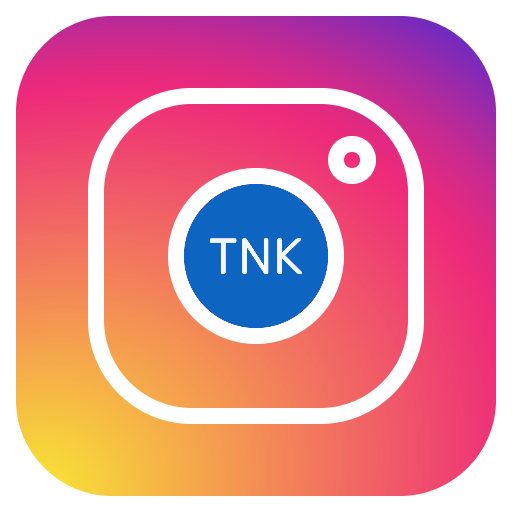

# SharePoint Instagram feed Web Part

  

This web part enables Office 365 SharePoint users to embed Instagram feeds from any public Instagram account to SharePoint pages seamlessly with **NO NEED** for registering any **ACCESS_KEY**, **TOKEN** or **client applications**.

## Documentation

- [Installation Guide](documentation/installation-guide.md "Installation Guide")
- [Developer Guide](documentation/developer-guide.md "Developer Guide")

## Demo

## License

[MIT](LICENSE)
