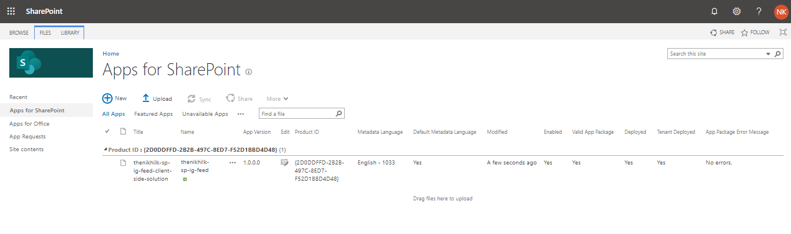

# Installation Guide

## Pre-requisites

To install this Web Part, you need:

- An Office 365 Tenant
- A SharePoint administrator account

## Download the Web Part package

Download the latest version of the SharePoint App (`*.sppkg`) from [releases](https://github.com/thenikhilk/sharepoint-instagram-feed/releases).

## Deploy the App in the SharePoint Apps Catalog

1. Go to the SharePoint admin page. Go to the apps section and click on the Apps Catalog (if the Apps Catalog do not exist, create it).
2. In the Apps Catalog, go to the Apps for SharePoint section.
3. Drag & Drop the downloaded `thenikhilk-sp-ig-feed.sppkg` file in the Apps list. Wait during the deployment and verify that the package is correctly installed.

## Add Web Part to a SharePoint Modern page

1. Add the Instagram Feed Web Part on a Page.
2. Got to Web Part settings to to configure username.

## Demo

## Questions

Feel free to an log issue in the [GitHub repo](https://github.com/thenikhilk/sharepoint-instagram-feed/issues).
